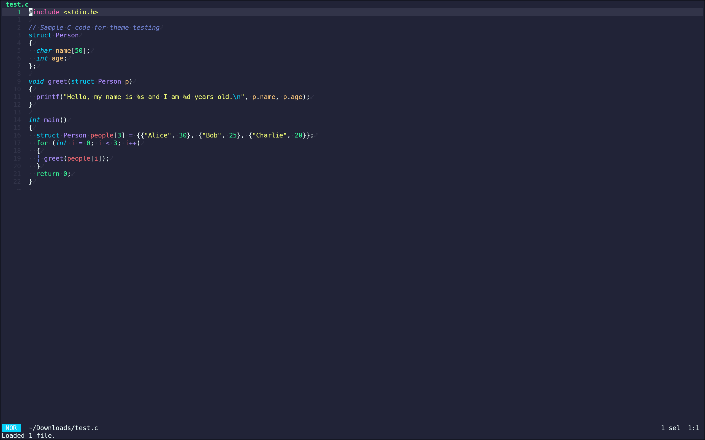
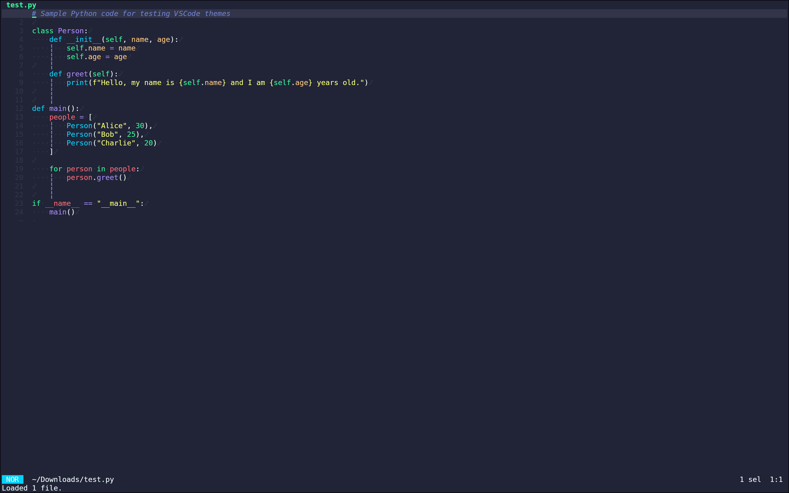

<!-- DO NOT CHANGE THIS -->

Eldritch is a community-driven dark theme inspired by Lovecraftian horror. With tones from the dark abyss and an emphasis on green and blue, it caters to those who appreciate the darker side of life.

Main Theme repo can be found [here](https://github.com/eldritch-theme/eldritch)

### Showcase
<!-- Your screenshot should go here -->
 
 

 Sample code taken from <a href="https://github.com/AliBinary/vscode-theme-test">AliBinary/vscode-theme-test</a>

### Installation
1. Clone this repo, or otherwise download the `eldritch.toml` file located [here](https://github.com/A-kly/eldritch-helix/blob/main/eldritch.toml).
2. Run `mkdir ~/.config/helix/themes` to create a new `themes` directory in the helix config folder.
3. Copy `eldritch.toml` into this folder.
4. Open helix by running `hx` in the terminal.
5. Inside of helix when in normal mode (NOR in bottom left corner), type `:` to enter command mode and run the command `config-open`.
6. Insert the line `theme = "eldritch"` somewhere into the start of the document. Make sure there is no other instances of the `theme` option.
7. Write and quit the file with `:wq`.
8. Reload the config file with `:config-reload` OR re-open helix and enjoy!

 Made with ♥ by Aurora. 

